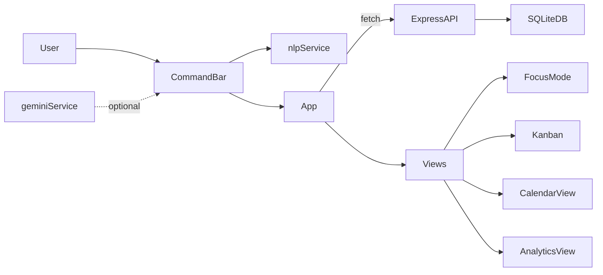

# The Flow OS — Contexto del Proyecto

Este documento resume el **mapa mental** del repo: stack, módulos, flujos y puntos de entrada para ubicar rápido dónde tocar (UI vs API vs NLP).

## Qué es

**The Flow OS** es una app de productividad basada en:

- **Captura rápida en lenguaje natural** (Ctrl/Cmd + Space o Ctrl/Cmd + K).
- **Visualización orgánica** (burbujas) + vistas **Kanban**, **Proyectos**, **Calendario**, **Analytics**.
- **Pomodoro** integrado (Focus Mode) con edición inline de la tarea.

## Stack

- **Frontend**: React 19 + TypeScript + Vite 6 + Tailwind CSS 4
  - Motion (`motion/react`) para animaciones
  - DnD Kit para drag & drop
  - Recharts para analytics
  - Lucide para iconos
- **Backend**: Express 4 (Node/TS) + `better-sqlite3`
- **NLP**:
  - Local: `chrono-node` (es) + heurísticas de prioridad
  - Opcional: Gemini (`@google/genai`) con `GEMINI_API_KEY` (inyectado en build por `vite.config.ts`)

## Cómo corre (scripts)

Ver `package.json`:

- `npm run dev`: corre `tsx watch server.ts` (API + Vite middleware en dev).
- `npm run dev:front`: corre solo Vite (útil si se separa el server o se usa proxy).
- `npm run build` / `npm run preview`: build y preview de Vite.

## Estructura de carpetas (hoy)

- `server.ts`: servidor Express + SQLite + rutas REST. También inicializa el schema.
- `src/main.tsx`: entrypoint React.
- `src/App.tsx`: componente “orquestador” (estado global, navegación, vistas, DnD, bulk actions, modales).
- `src/types.ts`: tipos base del dominio (`Task`, `Project`, etc.).
- `src/services/`:
  - `nlpService.ts`: parsing local
  - `geminiService.ts`: parsing con Gemini (no integrado por defecto en la captura)
- `src/components/`: UI por vista/feature (`CommandBar`, `FocusMode`, `CalendarView`, `AnalyticsView`, etc.)

## Modelo de datos (SQLite)

Definido en `server.ts`:

### `projects`

- `id` (TEXT PK)
- `name` (string)
- `color` (string nullable)

### `tasks`

- `id` (TEXT PK)
- `title` (string)
- `description` (string nullable)
- `status` (default: `backlog`) — `backlog | todo | doing | done`
- `priority` (default: 1) — 1..3
- `due_date` (ISO string nullable)
- `project_id` (FK nullable)
- `created_at` (default: current timestamp)
- `completed_at` (nullable)

## API (Express)

Rutas en `server.ts`:

- `GET /api/tasks`
  - Devuelve tareas activas + completadas en últimas 24h.
- `POST /api/tasks`
  - Inserta tarea.
- `PATCH /api/tasks/:id`
  - Update parcial. Si `status=done` y no viene `completed_at`, lo setea.
- `DELETE /api/tasks/:id`
- `GET /api/tasks/stats`
  - Stats últimos 7 días + totales (para Analytics).
- `GET /api/projects`
- `POST /api/projects`
  - Valida `name`, dedupe case-insensitive, genera `id` si no viene.
- `PATCH /api/projects/:id`
  - Valida `name`, dedupe case-insensitive.
- `DELETE /api/projects/:id`
  - Transacción: desasigna `project_id` en tasks y borra project.

## Flujos principales

### Captura rápida (CommandBar → API)

1. `src/components/CommandBar.tsx` escucha teclado, abre overlay.
2. `parseTaskInputLocally` (`src/services/nlpService.ts`) genera preview (title/due_date/priority).
3. Al submit:
   - infiere status: si input incluye `hoy` → `todo`, si no → selector rápido (`backlog|todo`)
   - intenta matchear proyecto por substring del nombre
4. `App` hace `POST /api/tasks` y refresca lista.

### Focus Mode (Pomodoro + edición)

- `src/components/FocusMode.tsx` muestra timer, permite editar campos y llama `onUpdate`.
- `App` persiste vía `PATCH /api/tasks/:id` con update optimista.

### Kanban (DnD + bulk)

- DnD cambia `status` optimista y persiste con `PATCH`.
- Selección múltiple y acciones masivas en `App.tsx` (mover, archivar, prioridad, due_date, eliminar).

### Analytics

- `src/components/AnalyticsView.tsx` calcula métricas y ofrece “Planificar próxima semana”:
  - toma hasta 3 tareas `backlog` por prioridad y las pasa a `todo`
  - asigna `due_date` al próximo lunes 9:00 si no tenían

## Diagrama rápido

## Notas útiles

- `geminiService.ts` existe pero la captura usa parsing local; integrar Gemini requiere decisión de fallback/costos.
- El alias `@` en Vite apunta a la **raíz del repo** (no a `src/`).

